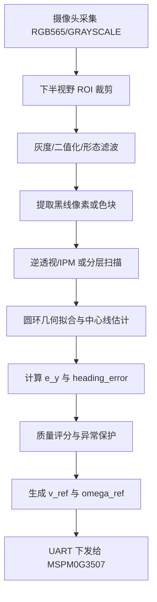

# K230 视觉循迹技术路线与任务计划书

日期：2026-05-04

## 1. 目标与边界

本阶段的下一步任务是完成 K230 侧的视觉循迹模块，为自平衡小车沿圆形黑线稳定行进提供可靠的路径观测量。

视觉循迹模块只负责“看见黑线并给出运动参考”，不直接闭合车体平衡环。平衡、速度闭环、电机驱动和跌倒保护仍由 MSPM0G3507 主控负责。K230 的输出应是低频、平滑、可解释的运动指令或路径误差，而不是直接电机 PWM。

### 输入

- 地面循迹摄像头图像。
- MSPM0G3507 通过 UART 上传的车体状态，至少包括 `pitch`、车速、运行模式、心跳。
- 标定参数：摄像头安装高度、俯仰角、内参近似值、ROI、黑线阈值、圆环半径。

### 输出

- `e_y`：车体相对黑线中心的横向偏差，单位建议为 mm。
- `heading_error`：车体切向方向与目标圆环切线方向的夹角误差，单位建议为 rad 或 0.01 deg。
- `line_quality`：视觉可信度，范围 0~100。
- `v_ref`、`omega_ref`：给 MSPM0G3507 的期望前进速度和角速度。
- 调试叠加图：ROI、二值图、黑线中心点、拟合圆/切线、FPS、质量评分。

## 2. 总体技术路线

推荐采用“传统视觉 + 几何先验 + 状态机”的路线，先不引入神经网络。原因是赛题黑线几何明确、颜色简单、实时性要求高，传统算法更容易解释、调参和稳定运行。

核心流程如下：



## 3. 摄像头与图像配置

### 分辨率建议

第一阶段使用 `320x240` 或 `400x240` 做循迹处理，LCD/IDE 可显示放大后的调试图。不要一开始使用 `800x480` 做算法主输入，否则帧率、内存和调试复杂度都会上升。

建议配置：

- 算法输入：`Sensor.RGB565`，`320x240`。
- 显示输出：调试期 `Display.VIRT` 或 LCD OSD；比赛期可关闭或降低显示频率。
- 目标算法帧率：初期 ≥20 FPS，稳定后 ≥30 FPS。

### ROI 建议

地面摄像头应朝向车体前下方。循迹只处理地面区域，建议只取图像下半部分或中下部梯形区域：

- 近处 ROI：用于横向偏差，权重最高。
- 中距 ROI：用于估计切线方向。
- 远处 ROI：用于提前感知曲率，但受俯仰影响最大，权重较低。

## 4. 黑线检测算法

### 第一版：分层扫描质心法

这是最建议优先实现的版本，简单、实时、抗小面积噪声能力较好。

处理步骤：

1. 将图像转灰度或直接使用 RGB565 的亮度统计。
2. 在多个水平扫描带中寻找黑色像素。
3. 对每个扫描带计算黑线像素的横向质心 `cx_i`。
4. 过滤宽度异常的扫描带，避免把阴影、车轮、背景边缘当作黑线。
5. 以近处扫描带的 `cx` 计算横向偏差，以多个 `cx_i` 的趋势计算方向误差。

优点：

- 算法量小，适合 MicroPython。
- 调参直观，便于 LCD 叠加显示。
- 即使圆环只出现局部弧线，也能稳定给出方向。

缺点：

- 对光照变化敏感，需要自动阈值或自适应阈值。
- 俯仰变化会导致远处扫描带位置抖动，需要结合 `pitch` 做补偿或降低远处权重。

### 第二版：二值图 + blob/连通域法

当黑线和背景对比明显时，可以用 `image.find_blobs()` 查找黑色区域，结合面积、宽高比、位置筛选主黑线。

处理步骤：

1. 使用黑线阈值生成二值结果。
2. 调用 `find_blobs()`，筛选面积和像素数。
3. 选择最可信 blob 或合并相邻 blob。
4. 从 blob 中心、边界框和主轴方向估计路径偏差。

该方法适合做辅助检测，不建议单独依赖整图最大 blob，因为圆环局部弧线、遮挡和反光会让最大连通域跳变。

### 第三版：IPM 逆透视 + 圆环几何

稳定版应加入 IPM 或近似鸟瞰变换，将图像坐标映射到地面坐标。

K230 的 `image.rotation_corr(..., corners=...)` 可用于四点映射。实际落地时可以先手动标定四个地面点，把梯形视野变换为矩形鸟瞰图。

IPM 后的核心计算：

- 黑线宽度约 `18 mm`，圆环内径约 `800 mm`，中心线半径约 `409 mm`。
- 根据鸟瞰图中的黑线像素估计当前车体相对圆环中心线的横向偏差。
- 用局部弧线方向估计目标切向方向，得到 `heading_error`。

## 5. 圆环循迹控制策略

### 输出运动指令

K230 不直接输出左右轮速度，而输出：

```text
v_ref      期望前进速度
omega_ref 期望角速度
quality   视觉质量
```

推荐控制律：

```text
omega_ref = k_y * e_y + k_h * heading_error + k_c * curvature_ff
```

其中：

- `k_y`：横向偏差反馈。
- `k_h`：航向误差反馈。
- `curvature_ff`：圆环曲率前馈，约等于 `v_ref / R`。
- `R`：目标圆环中心线半径，约 `0.409 m`。

### 速度调度

视觉质量高、偏差小的时候提高速度；偏差大或识别不稳定时自动降速。

建议初期策略：

- `quality >= 80` 且 `abs(e_y) < 20 mm`：正常速度。
- `quality 50~80`：低速。
- `quality < 50` 或连续丢线：发送 `v_ref=0`，要求主控原地平衡。

## 6. 标定流程

视觉循迹能否稳定，关键在标定。建议把标定流程做成独立脚本或独立模式。

### 黑线阈值标定

1. 在实际赛道光照下采集背景和黑线 ROI。
2. 读取 ROI 亮度统计，记录黑线与背景的灰度分布。
3. 初期使用固定阈值，后续改为自适应阈值：
   - `threshold = background_mean - margin`
   - 或按 ROI 直方图 Otsu 阈值。

### 摄像头安装标定

需要记录：

- 摄像头安装高度。
- 摄像头相对车体的俯仰角。
- 图像中心点。
- 地面上 4 个已知点在图像中的像素坐标，用于 IPM。

### 像素到毫米标定

在地面放置标尺或棋盘格，获得鸟瞰图中：

```text
mm_per_pixel_x
mm_per_pixel_y
```

没有完成该标定前，`e_y` 可先用像素单位，但 UART 协议中建议预留毫米单位。

## 7. 软件模块划分

建议 K230 侧拆成以下文件或类，避免把所有逻辑堆在摄像头示例中。

```text
vision/
  line_camera.py       摄像头初始化、取帧、显示
  line_detector.py     黑线二值化、扫描带、blob、质量评分
  ground_mapper.py     ROI/IPM/像素到地面坐标
  line_tracker.py      e_y、heading_error、v/omega 计算
  uart_protocol.py     与 MSPM0G3507 的帧协议
  debug_overlay.py     LCD/IDE 调试叠加
  config.py            阈值、ROI、标定参数
```

当前 `camera_single_bind_lcd.py` 可继续作为最小摄像头验证脚本。正式循迹建议新建 `vision_line_tracking.py`，避免污染基础预览示例。

## 8. UART 数据接口建议

### K230 接收主控状态

```text
IMU_TELEM
- timestamp_ms
- pitch_deg_x100
- pitch_rate_dps_x100
- speed_mm_s
- balance_state
- battery_mv
```

### K230 发送运动命令

```text
MOTION_CMD
- mode
- v_ref_mm_s
- omega_ref_mrad_s
- line_error_mm
- heading_error_mrad
- quality
- flags
```

### 关键失效策略

- K230 连续丢线超过 `200 ms`：发送低速或停车平衡命令。
- K230 心跳丢失超过 `200 ms`：MSPM0G3507 自行进入原地平衡。
- 主控上报 pitch 超限：K230 停止提高速度，并冻结循迹输出。

## 9. 分阶段任务计划

### 阶段 A：摄像头基础采集

目标：稳定获得地面图像，并能在 LCD/IDE 上显示调试叠加。

任务：

- 新建 `vision_line_tracking.py`。
- 配置循迹摄像头为 `320x240` 或 `400x240`。
- 实现 FPS 显示、ROI 框显示、基础退出保护。
- 固定摄像头安装角度，拍摄黑线样张。

验收：

- 连续运行 10 分钟无异常。
- 算法输入帧率 ≥30 FPS，若带显示调试 ≥20 FPS。

### 阶段 B：黑线阈值与分层扫描

目标：在静态赛道上稳定识别黑线中心。

任务：

- 实现多扫描带质心检测。
- 输出每个扫描带的 `cx_i`、有效宽度、有效像素数。
- 设计 `line_quality` 评分。
- LCD 叠加显示扫描带、中心点、黑线宽度。

验收：

- 静止状态下 `cx` 抖动小于 5 像素。
- 光照轻微变化时不误检大面积背景。

### 阶段 C：路径误差计算

目标：从像素检测结果得到可控的 `e_y` 与 `heading_error`。

任务：

- 近处扫描带计算横向偏差。
- 多扫描带拟合局部方向。
- 对输出做限幅和一阶低通滤波。
- 加入丢线保持与恢复逻辑。

验收：

- 手推小车沿黑线移动时，误差方向正确。
- 左偏/右偏输出符号稳定，不跳变。

### 阶段 D：UART 联调

目标：K230 能把循迹结果发送给 MSPM0G3507，主控能安全消费。

任务：

- 实现 `MOTION_CMD` 帧编码。
- 增加 `quality`、错误位、心跳。
- PC 串口工具或主控端打印验证帧内容。
- 先不驱动车轮，只做数据链路验证。

验收：

- 连续发送 10 分钟无明显丢帧。
- 主控能识别心跳超时并降级。

### 阶段 E：低速闭环循迹

目标：小车在主控平衡稳定前提下，以低速沿圆环走局部弧段。

任务：

- 设定低速 `v_ref`。
- 使用 `omega_ref = k_y * e_y + k_h * heading_error`。
- 调整限幅，避免角速度命令突变影响平衡。
- 记录误差、速度、质量评分。

验收：

- 低速连续沿黑线运行不少于 1/4 圈。
- 丢线后能停车平衡，而不是继续冲出赛道。

### 阶段 F：完整一圈与提速

目标：完成基础要求的一圈循迹。

任务：

- 加入圆环曲率前馈。
- 根据质量评分动态调速。
- 用相位/里程/视觉特征组合判断完成一圈。
- 与激光瞄准模块协调处理速度和云台扰动。

验收：

- 完整一圈不脱离黑线超过 2 秒。
- 回到起点附近后主控能稳定站立并提示。

## 10. 调试与数据记录

建议每次调试记录以下数据：

- 时间戳。
- FPS。
- `e_y`、`heading_error`、`quality`。
- `v_ref`、`omega_ref`。
- 主控 pitch、车速、状态。
- 丢线次数与持续时间。

K230 端可以先通过串口打印 CSV 样式日志，后续再改成文件记录或无线遥测。

## 11. 验收指标

视觉模块独立验收：

- 静态黑线中心识别抖动：≤5 px。
- 正常光照下有效识别率：≥95%。
- 单帧处理时间：≤30 ms。
- 丢线检测延迟：≤100 ms。
- 误检大面积背景时能输出低质量，而不是错误高置信命令。

整车联调验收：

- 低速完成 1/4 圈。
- 低速完成 1 圈。
- 提速后仍能保持黑线连续跟踪。
- 通讯异常或视觉丢失时，主控进入原地平衡保护。

## 12. 主要风险与预案

### 光照和地面反光

风险：固定阈值失效。

预案：使用 ROI 统计自适应阈值；必要时加遮光罩或偏振片。

### 车体俯仰导致图像抖动

风险：远处黑线位置跳动，角度估计不稳。

预案：近处 ROI 权重更高；使用主控 pitch 做 IPM 参数补偿；输出低通滤波。

### MicroPython 性能不足

风险：高分辨率图像处理帧率不够。

预案：降低算法输入分辨率；减少全图操作；扫描带替代整图 blob；比赛期关闭高频显示。

### 圆环曲率与平衡控制耦合

风险：角速度命令过激导致平衡车晃动甚至倒车。

预案：所有 `omega_ref` 做限幅、斜率限制和质量门控；先低速调通，再逐步加速度。

## 13. 近期最小可执行任务

下一步建议只做一个最小闭环视觉验证：

1. 新建 `vision_line_tracking.py`。
2. 采集 `320x240 RGB565` 图像。
3. 只处理下半屏 5 条水平扫描带。
4. 用固定灰度阈值提取黑线。
5. 在 LCD/IDE 上画出 ROI、中心点和 `e_y_px`。
6. 串口或控制台打印 `e_y_px, heading_error_px, quality, fps`。

这个版本不发运动命令，只验证“看得见、算得稳、方向对”。通过后再接 UART 和主控运动闭环。
