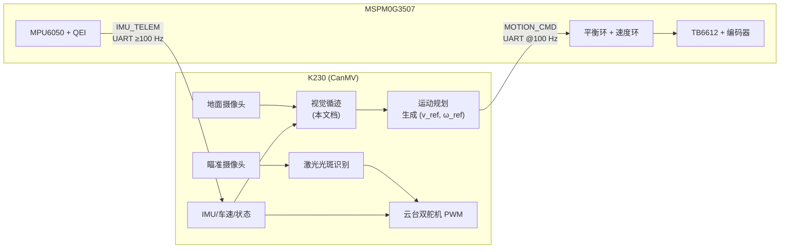
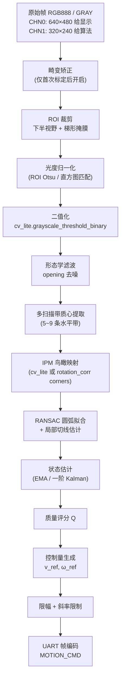

# K230 视觉循迹技术路线与任务计划书（最终版）

文档版本：v2.0（由自动化控制 / 机器视觉专家视角修订）
修订日期：2026-05-04
适用范围：自平衡瞄准小车项目中 K230（CanMV）侧循迹子系统

---

## 0. 本版相对 v1 的主要修订

1. **边界更清晰**：明确 K230 循迹子系统与云台、激光、主控之间的信号流与优先级。
2. **量纲与接口契约化**：所有对外输出给出定点缩放系数、单位、取值范围，直接对应 UART 协议字段。
3. **算法绑定 API 可行性**：全部算法步骤映射到 K230 的 `openmv.image`、`cv_lite`、`ulab.numpy` 与 `machine.UART`，不写不能落地的想当然。
4. **引入状态估计与控制理论层**：明确前馈/反馈结构、限幅/斜率限制/时域滤波、非完整约束下的曲率调度。
5. **标定流程工程化**：内参、外参（IPM）、光度（阈值/白平衡/曝光）、运动学各自独立。
6. **失效与降级策略分级**：按丢线时长、质量评分、心跳状态分级响应。
7. **分阶段验收引入可度量指标**：给出具体的 FPS、像素抖动 SD、延迟、命令抖动等数值阈值。
8. **增加性能预算与 MicroPython 优化守则**：强调 `ALLOC_REF` 零拷贝、避免 Python 逐像素循环、优先 `cv_lite`。

---

## 1. 目标与边界

### 1.1 子系统定位

K230 视觉循迹子系统是整车控制环的 **路径观测器 + 运动规划器**，不闭合车体平衡环，也不直接驱动电机 PWM。其核心职责是：

1. 从地面摄像头稳定地看见直径 800 mm 的圆形黑线赛道。
2. 输出 **低频、平滑、可解释** 的运动参考量（横向偏差 `e_y`、航向误差 `ψ_e`、期望前进速度 `v_ref`、期望角速度 `ω_ref`、视觉质量 `Q`）。
3. 在识别退化时发出可被主控安全消费的降级指令，绝不允许输出错误的高置信命令。

平衡、速度闭环、电机驱动、跌倒保护仍由 MSPM0G3507 主控负责。

### 1.2 输入

- **地面循迹摄像头**：朝车体前下方，负责看见黑线。
- **主控状态（UART）**：`pitch_deg`、`pitch_rate_dps`、车速 `v_body_mm_s`、平衡/运行状态位、心跳、电池电压。
- **标定参数**（Flash / JSON）：相机内参、安装外参（高度、俯仰、偏航）、IPM 四点对应、黑线/背景灰度分布、圆环半径先验、控制增益、限幅参数。

### 1.3 输出（发送给主控）

| 字段 | 单位 / 缩放 | 取值范围 | 说明 |
|------|-------------|----------|------|
| `e_y` | mm（int16） | ±300 | 车体中线相对黑线中心的横向偏差，正号为偏右 |
| `heading_error` | mrad（int16） | ±1570 | 车头方向相对目标切线方向的航向误差，正号为偏右 |
| `v_ref` | mm/s（int16） | 0~600 | 期望前进速度 |
| `omega_ref` | mrad/s（int16） | ±2500 | 期望车体角速度，正号为右转 |
| `quality` | 0~100（uint8） | 0~100 | 视觉质量评分，阈值见 §5 |
| `flags` | 位域（uint8） | — | 丢线保持、降级、报警等状态 |
| `seq` | uint16 | — | 单调递增帧序号，主控用于检测丢帧 |

### 1.4 显示输出（调试用）

调试叠加图：ROI 边框、二值图、扫描带中心点、拟合圆/切线、`e_y/ψ_e` 箭头、FPS、Q 评分、帧序号。正式比赛时通过 `config.debug_display=False` 关闭，以释放带宽与 CPU。

### 1.5 非目标（本子系统明确不做）

- 不做神经网络推理（如需识别障碍或瓶子，交给 K230 的另一路摄像头 + AI Demo 分支处理，不在本文档范围）。
- 不直接输出左右轮 PWM 或占空比。
- 不负责 IMU 滤波与平衡环增益。

---

## 2. 系统架构与接口契约

### 2.1 整车信号流



**关键设计原则**：

1. **单向数据单向控制**：K230 只下发运动参考，主控只上传车体状态；避免双向竞争写同一状态。
2. **时间解耦**：视觉环 30~60 Hz，平衡环 200~500 Hz，二者异步通过双向心跳同步，不做硬时间锁。
3. **能量边界**：电机执行器只接受 `(v_ref, ω_ref)`，K230 永远不能越过 `MOTION_CMD` 直接控制电机。

### 2.2 模块间的契约（Contract）

| 接口 | 生产者 | 消费者 | 速率 | 失效后果 |
|------|--------|--------|------|----------|
| `MOTION_CMD` | K230 | 主控 | 100 Hz | 超过 200 ms 未收到 → 主控进入原地平衡 |
| `IMU_TELEM` | 主控 | K230 | ≥100 Hz | 超过 200 ms 未收到 → K230 冻结 IPM 俯仰补偿、降 Q |
| `HEARTBEAT` | 双向 | 双向 | 10 Hz | 2 次连续缺失 → 双方都进入降级 |
| `ERROR` | 任一 | 另一侧 | 事件驱动 | 立即降级 + 声光提示 |

### 2.3 坐标与符号约定

- **车体坐标系 B**：原点在两轮中点地面投影，x 轴指向车头前进方向，y 轴指向车头左侧，z 轴向上。
- **相机坐标系 C**：遵循 OpenCV 约定，z 轴沿光轴指向前方。
- **地面坐标系 G（IPM 后）**：与 B 重合，单位 mm。
- **航向正负**：俯视下逆时针为正；`heading_error` 正号表示车头相对目标切线方向偏左（需与主控转向符号联调一致）。
- **偏差正负**：`e_y` 正号表示黑线在车体 y 轴负向（即车偏右于黑线）。以上两项符号最终以联调表为准，写入 `config.py`。

---

## 3. 总体技术路线

采用 **"传统视觉 + 几何先验 + 状态估计 + 分级降级"** 的路线。赛题约束（单色黑线、已知内径 800 mm、闭合圆环、近距离视野）使几何先验极强，神经网络在本场景无额外收益却会带来延迟与可解释性风险。

核心流水线：



**回退链**：`IPM + RANSAC 圆弧` → `仅多扫描带质心` → `最近处单扫描带` → `丢线保持上一帧` → `零速停车平衡`。每级都有独立的质量阈值，见 §5 与 §8。

---

## 4. 摄像头、光学与图像配置

### 4.1 安装几何（建议初值，标定后以实测为准）

| 参数 | 建议值 | 说明 |
|------|--------|------|
| 摄像头离地高度 `h_cam` | 80~150 mm | 越低近处分辨率越高，但前视距离受限 |
| 光轴俯仰角 `θ_pitch` | 15°~25°（向下） | 保证近处边界 ≥ 120 mm、远处边界 ≤ 600 mm |
| 光轴偏航 `θ_yaw` | 0°（对齐车体 x 轴） | 实测偏差 ≤ 1° |
| 近处边界 | 120~180 mm | 决定最小反应距离，不得小于一个车轮外径 |
| 远处边界 | 450~600 mm | 大于圆环中心线弧长一段足以估计曲率 |

视野建议按 **下视野覆盖 2.5~3 倍车体宽度** 选型，避免车体晃动导致黑线贴边缘。

### 4.2 分辨率与像素格式

| 通道 | 分辨率 | 像素格式 | 用途 |
|------|--------|----------|------|
| Sensor CHN0 | 800×480 或 640×480 | `YUV420SP` | 绑定 LCD/IDE 显示，低优先级 |
| Sensor CHN1 | 320×240（首选）或 400×240 | `GRAYSCALE` 或 `RGB888` | **算法主输入**，保证 ≥30 FPS |

- **首选 `GRAYSCALE`**：黑线本身是灰度特征，避免 RGB→gray 的转换开销；`cv_lite.grayscale_*` 系列接口比 RGB888 版本快 10~30%。
- 需要 `cv_lite.rgb888_*` 或彩色调试时再启用 RGB888，但记得同步调小算法分辨率。

### 4.3 ROI 策略

ROI 取下半视野，并分为 3 个权重子带：

| 子带 | 图像 y 范围（320×240 内） | 对应地面距离 | 权重 | 主要用途 |
|------|---------------------------|--------------|------|----------|
| 近处 | 180~230 | 120~250 mm | 0.5 | `e_y` 主来源，抖动最小 |
| 中距 | 130~180 | 250~400 mm | 0.3 | `ψ_e` 切线方向估计 |
| 远处 | 80~130 | 400~600 mm | 0.2 | 曲率前馈、提前预判 |

- ROI 顶部以上不再处理，直接不取像素，可节约 30% 算力。
- ROI 左右边界根据车体宽度做梯形掩膜（`image.Image.mask`），屏蔽车轮、底盘投影、阴影区域。
- 所有 ROI 数值写入 `config.py` 并在调试叠加图中绘出，不在脚本硬编码。

### 4.4 曝光 / 白平衡 / 对焦策略

- **关闭自动白平衡 AWB**（若 Sensor 驱动支持）：比赛场光照固定，AWB 会在红色赛道边线或地毯反光时漂移，反而影响阈值稳定性。
- **固定曝光**：以实际比赛光照预先采几十帧，挑出黑线/背景对比度最大的一组曝光参数，写入启动脚本。
- **对焦**：使用定焦镜头，近焦距 100~1000 mm 范围内清晰即可。

---

## 5. 标定流程（三类互相独立，缺一不可）

标定是全系统精度与鲁棒性的决定性环节。所有结果写入 `calib.json`，由 `config.py` 在启动时加载并校验版本号。

### 5.1 相机内参标定（一次性）

- 方法：9×6 棋盘格（25 mm 方格），在 PC 上用 OpenCV `calibrateCamera` 求 `K, dist`；K230 端读取。
- 输出：`camera_matrix` (3×3)、`dist_coeffs` (k1, k2, p1, p2, k3)。
- 使用：
  - 首帧启动时调用 `cv_lite.rgb888_undistort_new_cam_mat` 或 `rgb888_undistort_fast` 产生查找表；
  - 运行期若性能吃紧，可跳过畸变矫正，只在 IPM 映射点表里预补偿（等价效果，零在线成本）。

### 5.2 安装外参与 IPM 标定（每次摄像头支架改动后重做）

- 方法：在车前方地面贴 4 个已知坐标的十字靶标（构成 300 mm × 200 mm 的梯形），手动点选图像像素 → 地面 mm 坐标；解算 3×3 单应矩阵 `H`。
- 两种实现二选一：
  1. `img.rotation_corr(corners=[(u0,v0),...])` 得到鸟瞰图；优点：一行代码；缺点：非 K230 专门加速，帧率可能掉 5~10 FPS。
  2. **预计算像素查找表**：把 ROI 内每个像素的 `(u,v)→(x_g, y_g)` 存成一对 `ulab.numpy.ndarray`，运行期不做 IPM 图像变换，只把检测出的像素点通过查表换算为地面坐标。**首选方案**，CPU 代价接近零。
- 输出：`H`（3×3）、`mm_per_pixel_x_near`、`mm_per_pixel_y_near`、`ipm_lut_u`、`ipm_lut_v`、近处与远处的像素到 mm 换算系数。

### 5.3 光度标定（每次场地光照改变时快速重做，目标 < 10 s）

- 在 `calibrate_photometric.py` 脚本下：
  1. 采集 30 帧 ROI 图像；
  2. 用 `image.get_statistics()` 或 `cv_lite.rgb888_calc_histogram` 得到直方图；
  3. 用双峰判定（Otsu）得到阈值 `thr_otsu`；
  4. 取背景亮度 `μ_bg`、标准差 `σ_bg`，记录阈值保底值 `thr_fallback = μ_bg − 3σ_bg`；
  5. 输出 `line_threshold = (thr_otsu + thr_fallback) / 2` 作为初始阈值。
- 运行期策略：每 1 s 取一次 ROI 直方图，若 `|μ_bg(t) − μ_bg(t−1)| > 15` 则触发一次重标定（不阻塞主循环，放在低优先级任务）。

### 5.4 运动学标定（由主控侧执行，此处仅记录）

- 轮径、轮距、编码器 PPR、电机死区由主控完成并上报到 K230 的状态帧，`v_body_mm_s` 直接使用即可。
- K230 不做运动学原始标定，但要在 `config.py` 里记录本轮 `wheel_base_mm`、`max_v_mm_s`，作为 `ω_ref = v_ref × tan(δ) / L` 的上限估计。

---

## 6. 黑线检测算法

### 6.1 层级化设计（主算法 + 两级备份）

| 层级 | 算法 | 耗时预算 | 输出 | 触发条件 |
|------|------|----------|------|----------|
| L0 | ROI 灰度化 + `cv_lite.grayscale_threshold_binary` | ≤ 3 ms | 二值图 | 每帧 |
| L1 | 形态学 opening（3×3，1 次迭代） | ≤ 2 ms | 去噪二值图 | 每帧 |
| L2 | **5 条水平扫描带质心**（主算法） | ≤ 5 ms | `cx_i, width_i, mass_i` | 每帧 |
| L3a | IPM 查表 + RANSAC 圆弧拟合 | ≤ 8 ms | 圆心 (xc, yc)、半径估计 R̂ | 每 3 帧 |
| L3b | 局部一阶回归切线 `image.get_regression()` | ≤ 5 ms | 切线 θ | L3a 失败时的 fallback |
| L4 | Hough 圆检测 `cv_lite.grayscale_find_circles` | ≤ 15 ms | 全局圆心 | 起步定位 / 异常恢复 |

**L2 是唯一每帧必须成功的层级**。L3/L4 失败仅降 Q、保留上一帧结果，不会让系统直接进入无输出状态。

### 6.2 多扫描带质心法（主算法实现要点）

扫描带选取：

- 在 240×320 的 ROI 内选 5 条水平带，各带高度 8 行，间距均匀。
- 每条带上对二值图做 **行向 numpy 向量化求和** 得到投影 `col_sum[i]`，再在其上找到：
  - 总质量 `mass_i = sum(col_sum[i])`
  - 质心 `cx_i = Σ x·col_sum[i] / mass_i`
  - 等效宽度 `w_i = (max col_sum) / 255` 或用连通段最大长度
- **硬约束**（逐条带过滤）：
  1. `mass_i ≥ min_mass`（避免把空白当黑线）；
  2. `w_min ≤ w_i ≤ w_max`（根据 IPM 前像素宽度预期范围，例如近带 12~24 px）；
  3. `|cx_i − cx_i-1| ≤ Δx_max`（相邻扫描带连续性约束）。
- 任一条带不合格：**只剔除该带**，不整帧作废。
- 实现层建议：全部通过 `ulab.numpy` 向量切片完成，禁止 Python for 逐像素循环。

### 6.3 IPM + RANSAC 圆弧拟合（L3a）

- 使用 §5.2 预计算的查找表，把 L2 输出的每条带 `(u_i, cx_i)` 直接映射成地面坐标 `(x_g_i, y_g_i)`。
- 用 RANSAC + 代数圆拟合：
  1. 最小样本 3 点，迭代 20~40 次；
  2. 内点判据 `|sqrt((x−xc)² + (y−yc)²) − R̂| < ε`，`ε = 10 mm`；
  3. 先验约束 `|R̂ − 409| < 50 mm`（中心线半径先验）；不满足直接丢弃该假设。
- 拟合成功后：
  - 以车体位置 `(0, 0)` 到圆心的方向推导局部切线方向；
  - `ψ_e = atan2(x_tangent, y_tangent) − 0`（车体朝向定义为 x 正向）；
  - `e_y = |d_to_center| − 409`，再按符号约定乘 ±1。

### 6.4 一阶线性回归切线（L3b）

- 当 RANSAC 内点不足或 `R̂` 出圈时，改用 `image.get_regression(thresholds, robust=True)` 对 ROI 中距带做直线拟合，取斜率 θ 作为近似切线。
- 该层仅用于小曲率段（例如刚上路 20 cm 内），不用于整圈。

### 6.5 Hough 圆回滚（L4）

- 只在以下两种情形使用，避免 15 ms 级开销拖垮主循环：
  1. 起步 / 重新寻线（`state==SEARCHING`）；
  2. 连续 10 帧 L3a/L3b 全部失败。
- 参数建议：`dp=1.2, minDist=80, param1=80, param2=25, minR=200*px/mm, maxR=620*px/mm`（px/mm 系数按 IPM 近带像素换算）。
- 成功一次即切回 L3a 正常流水线。

### 6.6 质量评分 Q（0~100）

```text
Q = w_mass  * sat(mass_total / mass_nominal, 0, 1) * 100
  + w_geom  * sat(inlier_ratio, 0, 1)              * 100
  + w_cont  * (1 − jitter_cx / jitter_ref)         * 100
  + w_r_prior * (1 − |R̂ − 409| / 80)                * 100
最后归一化到 0~100
```

建议权重：`w_mass=0.3, w_geom=0.3, w_cont=0.2, w_r_prior=0.2`。

- `Q ≥ 80`：全部信息有效，允许加速。
- `60 ≤ Q < 80`：降速至 60% 名义速度。
- `40 ≤ Q < 60`：保持上一帧误差输出，禁止加速；`flags.degrade = 1`。
- `Q < 40`：视为丢线，见 §8 降级。

---

## 7. 控制量生成

### 7.1 前馈 + 反馈的控制律

对两轮差速自平衡小车的循迹运动，角速度期望由三项叠加构成：

```text
ω_ref = ω_ff + ω_fb
ω_ff = v_ref / R_hat                        # 圆环曲率前馈
ω_fb = k_y  * e_y        (mm  → mrad/s)
     + k_ψ * ψ_e         (mrad → mrad/s)
     + k_d * (ψ_e − ψ_e_prev) * f_loop     # 可选微分项
```

**前馈是圆弧循迹能不能"贴住"的关键**——没有它，反馈项必须把圆弧曲率"抗"出来，会表现为稳态外偏。推荐初始值（120 mm/s、R=409 mm 工况）：

| 增益 | 初值 | 单位 | 说明 |
|------|------|------|------|
| `k_y` | 3.0~6.0 | mrad/s per mm | 偏差越大转得越急 |
| `k_ψ` | 0.8~1.5 | mrad/s per mrad | 偏差方向越偏转越快 |
| `k_d` | 0~0.2 | mrad/s per (mrad·s) | 有抖动再加 |

调试顺序：先关 `k_d`、关前馈，手推车体观察 `k_y` 单独作用的响应；再加前馈，观察稳态贴线；最后加 `k_ψ` 改善收敛速度。

### 7.2 速度调度

```text
if Q >= 80 and |e_y| < 20 and |ψ_e| < 200:
    v_ref = v_nominal
elif Q >= 60:
    v_ref = v_nominal * 0.6
elif Q >= 40:
    v_ref = v_nominal * 0.3  # 保持惯性滑行
else:
    v_ref = 0                # 丢线停车
```

- 初期 `v_nominal = 120 mm/s`；阶段 F 目标 ≥ 300 mm/s（配合主控最大安全车速）。
- 加速度限制：`|dv_ref/dt| ≤ 400 mm/s²`，避免扰动平衡环。
- 减速允许更激进：`|dv_ref/dt|_brake ≤ 800 mm/s²`。

### 7.3 限幅与斜率限制（slew-rate limiter）

所有输出在写入 UART 帧前经过同一级限幅：

```text
ω_ref   ← clip(ω_ref, ±ω_max = 2000 mrad/s)
ω_ref   ← ω_prev + clip(ω_ref − ω_prev, ±Δω_max = 600 mrad/s · dt)
v_ref   ← clip(v_ref, 0, v_max)
v_ref   ← v_prev + clip(v_ref − v_prev, ±Δv_max · dt)
```

- 斜率限制意义：避免 20 Hz 视觉帧偶发抖动直接变成角速度阶跃，扰动 200 Hz 的平衡环。
- 限幅参数写入 `config.py`，每一级都在调试叠加图里可视化。

### 7.4 时域状态估计（可选升级）

- **一阶 EMA（首选）**：`e_y_f = α e_y + (1−α) e_y_prev`，`α = 0.4~0.6`；零额外延迟的简化版。
- **一维 Kalman（阶段 E 之后）**：状态 `[e_y, e_y_dot]`，过程噪声 `σ_q`、观测噪声 `σ_r` 由离线数据估计；在高速阶段显著降低抖动。
- 滤波器只作用在 `e_y, ψ_e`，不滤波 `Q`（`Q` 一滞后就丧失及时降级能力）。

### 7.5 非完整约束兼容性说明

两轮自平衡车为非完整约束系统：瞬时速度方向必须沿车体 x 轴。因此 `(v_ref, ω_ref)` 组合必须满足 `|ω_ref| ≤ v_ref / R_min + ω_spin_max`，其中 `R_min ≈ 200 mm`（经验值，取决于主控限幅）。当 `v_ref = 0` 时 `ω_spin_max ≤ 500 mrad/s`（慢速原地校正）。超过该约束的命令可能导致平衡车侧翻或失稳。

---

## 8. 失效保护与降级策略（分级响应）

| 级别 | 触发条件 | K230 动作 | 主控动作 |
|------|----------|-----------|----------|
| N0（正常） | `Q ≥ 80` 且近期无异常 | 全速循迹 | 正常执行 `MOTION_CMD` |
| N1（降速） | `60 ≤ Q < 80` 或 `
IMU_TELEM_jitter ≥ 2σ` | `v_ref ← 0.6 v_nominal`，关前馈加速项 | 正常执行 |
| N2（保守） | `40 ≤ Q < 60` 或 连续 3 帧 L3 失败 | `v_ref ← 0.3 v_nominal`，保持上一帧 `e_y`，`flags.degrade=1` | 可选降低电机最大扭矩 |
| N3（滑行） | `Q < 40` 但 ≤ 200 ms | `v_ref ← 0`，`ω_ref ← 0.5 ω_prev` | 执行；记录告警 |
| N4（停车） | 连续丢线 > 200 ms | `v_ref=0`、`ω_ref=0`、`flags.lost=1` | 进入原地平衡模式 |
| N5（主控失联） | K230 连续 200 ms 未收到 `IMU_TELEM` | 继续发 `flags.noimu=1`，冻结 IPM 俯仰补偿 | 独立动作（不归本模块） |
| N6（K230 失联） | 主控连续 200 ms 未收到 `MOTION_CMD` | — | 主控进入原地平衡 + 蜂鸣告警 |
| N7（硬错误） | K230 异常退出 / 栈溢出 | 看门狗复位 | 主控停车 + 声光持续告警 |

### 8.1 抖动抑制策略

- **符号防抖**：当 `sign(e_y)` 翻转时，要求连续 3 帧方向一致才认定真翻转，否则保留上次符号。
- **心跳丢失滞后**：进入 N5/N6 需连续 2 个心跳缺失，而离开只需要 1 次恢复，典型反滞环（hysteresis）。

### 8.2 重入安全

- 所有状态机转换在 UART 写帧前完成；一次 `while True` 循环只产生一帧 `MOTION_CMD`。
- `flags` 位域要求与主控联调时约定对齐（见 §10）。

---

## 9. 性能预算与 MicroPython 优化守则

### 9.1 单帧时间预算（目标 ≤ 30 ms 等效 33 FPS）

| 阶段 | 预算 (ms) | 实际上限 |
|------|-----------|----------|
| Sensor 抓帧 + DMA | 4 | 依 Sensor 驱动 |
| 畸变矫正（若启用） | 3 | `rgb888_undistort_fast` 实测 |
| ROI + 二值化 | 3 | `grayscale_threshold_binary` + 切片 |
| 形态学滤波 | 2 | 3×3 opening |
| 扫描带质心 (L2) | 5 | numpy 向量化 |
| IPM 查表 + RANSAC (L3a) | 8 | 每帧或每 3 帧 |
| 控制量生成 + 滤波 | 1 | 纯数学 |
| UART 帧编码 + 发送 | 1 | 非阻塞 |
| 调试叠加（仅调试） | 3 | 正式赛关闭 |
| **合计** | **30** | 预留 ≥ 3 ms 余量 |

### 9.2 强制性能守则

1. **图像操作优先 `cv_lite` 其次 `openmv.image`**：灰度二值化、形态学、find_blobs 差异可达 2~3 倍。
2. **内存零拷贝**：在 `cv_lite` 与 `image.Image` 之间用 `image.ALLOC_REF, data=np_array` 共享内存。
3. **禁止 Python 层逐像素循环**：所有逐像素操作必须由 `ulab.numpy` 或底层 C 函数完成。
4. **`img.to_numpy_ref()` 只取引用**：不可用 `.copy()`，除非明确需要快照。
5. **尽量少创建对象**：帧循环内不 `new` Image；使用一组预分配的缓冲区 `img_gray`、`img_bin`、`ipm_lut`。
6. **GC 控制**：开启 `gc.threshold(...)`，在 `while True` 外预创建所有容器；调试期每 5 s 调用 `gc.collect()` 观察内存碎片。
7. **调试叠加延迟绑定**：只在 `Q` 或控制命令改变时刷新 LCD OSD，不每帧全量重绘。
8. **UART 非阻塞**：`uart.write(buf)` 前用 `uart.any()` 检查写缓冲；不阻塞算法主循环。
9. **日志节流**：`print` 每秒不超过 20 条，避免主环境 stdout 成为瓶颈。
10. **取消大分辨率双显示**：CHN0 绑定显示时帧率降低到 ≥15 FPS 即可，CHN1 算法 ≥30 FPS。

### 9.3 内存预算

- 主要大块：原始帧 ≤ 640×480×1.5B（YUV420）≈ 460 KB；算法帧 320×240×1B（GRAY）= 77 KB；IPM LUT 2 张 ≤ 150 KB。
- 规划内所有缓冲区不超过 1.5 MB；预留 500 KB 给 UART DMA 环缓与日志缓存。

---

## 10. UART 通讯协议（定长帧，K230 ↔ MSPM0G3507）

### 10.1 物理层

- **UART 口**：K230 使用 `UART.UART1` 或 `UART.UART2`（避开被 SH 占用的 `UART0` / `UART3`）。
- **波特率**：461800（首选）或 921600；双向一致。
- **配置**：8N1，无流控；硬件若支持 DMA 务必启用。
- **物理电平**：3.3 V LVCMOS，共地；两板之间串联 100 Ω 小电阻防短路意外。

### 10.2 帧格式（小端序）

```text
+--------+--------+--------+--------+--------+--------+----------+--------+--------+
|  0xAA  |  0x55  |  LEN   |  CMD   |  SEQ_L |  SEQ_H | PAYLOAD  | CRC_L  | CRC_H  |
+--------+--------+--------+--------+--------+--------+----------+--------+--------+
  1B       1B      1B       1B       2B               LEN−4 字节   2B
```

- `LEN` 表示从 `CMD` 到 `CRC_H` 的字节数（含 CMD + SEQ2 + PAYLOAD + CRC2，最小值 6）。
- `SEQ` 为 16 位单调递增，溢出回绕；用于发现丢帧。
- `CRC` 为 CRC16-CCITT（多项式 `0x1021`，初值 `0xFFFF`），覆盖 `LEN | CMD | SEQ | PAYLOAD`。

### 10.3 CMD 列表

| CMD | 方向 | 名称 | PAYLOAD 长度 | 速率 |
|-----|------|------|--------------|------|
| 0x10 | MCU→K230 | `IMU_TELEM` | 12 | ≥100 Hz |
| 0x20 | K230→MCU | `MOTION_CMD` | 12 | 100 Hz |
| 0x30 | 双向 | `HEARTBEAT` | 2 | 10 Hz |
| 0x40 | 双向 | `ERROR` | 4 | 事件 |
| 0x50 | 双向 | `CONFIG` | 可变 | 调试期 |

### 10.4 `IMU_TELEM`（0x10, 12 字节）

| 偏移 | 字段 | 类型 | 缩放 | 说明 |
|------|------|------|------|------|
| 0 | `ts_ms` | uint32 | 1 ms | 主控上电后 ms |
| 4 | `pitch` | int16 | 0.01° | 正号车头向上 |
| 6 | `pitch_rate` | int16 | 0.01 °/s | — |
| 8 | `v_body` | int16 | mm/s | 车速，后退为负 |
| 10 | `state` | uint8 | — | bit0:balanced, bit1:moving, bit2:fault |
| 11 | `bat_10mv` | uint8 | 10 mV | 相对 6 V 基准 |

### 10.5 `MOTION_CMD`（0x20, 12 字节）

| 偏移 | 字段 | 类型 | 缩放 | 说明 |
|------|------|------|------|------|
| 0 | `mode` | uint8 | — | 0:idle, 1:track, 2:hold, 3:stop |
| 1 | `flags` | uint8 | — | 见 §10.6 |
| 2 | `v_ref` | int16 | mm/s | 期望前进速度 |
| 4 | `omega_ref` | int16 | mrad/s | 期望角速度 |
| 6 | `e_y` | int16 | mm | 横向偏差（调试 + 主控可选用作自己的外环） |
| 8 | `heading_error` | int16 | mrad | 航向误差 |
| 10 | `quality` | uint8 | 0~100 | 视觉质量 |
| 11 | `reserved` | uint8 | — | 对齐 |

### 10.6 `flags` 位域定义

| 位 | 名称 | 含义 |
|----|------|------|
| 0 | `degrade` | Q<80，已进入 N1/N2 |
| 1 | `lost` | 丢线保持中（N3/N4） |
| 2 | `noimu` | IMU_TELEM 超时 |
| 3 | `calib_change` | 光度/外参刚触发重标定 |
| 4 | `lap_done` | 一圈已完成（由圈数检测发出） |
| 5 | `reserved` | — |
| 6 | `reserved` | — |
| 7 | `heartbeat_alive` | 与主控心跳健康 |

### 10.7 `HEARTBEAT` / `ERROR` / `CONFIG`

- `HEARTBEAT`：2 字节，含发送方 `sender_id` 与 `liveness_counter`。超时 = 200 ms。
- `ERROR`：`code(uint16) + detail(uint16)`；主控或 K230 检测到不可恢复错误时发，附带最近一次 `SEQ`。
- `CONFIG`：调试期远程设置阈值、增益；正式赛禁用（靠 `flags` 检查版本匹配）。

### 10.8 解析与测试策略

- PC 端提供 `uart_dump.py` 脚本（不在本任务范围外还得写一份最小实现），可实时解码两端流量，输出 CSV；
- K230 端实现 **自我回环测试**：上电后 50 ms 先发 10 帧 `HEARTBEAT` 到主控并要求回环，回环失败即进入 N5。

---

## 11. 软件模块划分与代码规范

### 11.1 目录结构

```text
/k230_project/
├── vision_line_tracking.py        # 主入口，只写 while True 循环与顶层状态机
├── config.py                      # 编译期常量 + 从 calib.json 载入运行时参数
├── calib.json                     # 标定结果（不进 git，每机单独一份）
├── vision/
│   ├── __init__.py
│   ├── camera.py                  # Sensor / Display 初始化与封装
│   ├── photometric.py             # 阈值、Otsu、自适应重标定
│   ├── line_detector.py           # 二值化、形态学、扫描带质心
│   ├── ground_mapper.py           # IPM LUT 预计算、像素→mm 查表
│   ├── geometry.py                # RANSAC 圆、切线、一阶回归
│   ├── quality.py                 # Q 评分与降级状态机
│   ├── estimator.py               # EMA / Kalman
│   ├── controller.py              # 前馈+反馈控制律、限幅、斜率限制
│   └── debug_overlay.py           # LCD/IDE 可视化
├── comms/
│   ├── uart_link.py               # UART 初始化、非阻塞读写
│   ├── frame.py                   # 帧编解码、CRC16
│   └── protocol.py                # CMD 枚举、字段打包/解包
├── tools/
│   ├── calibrate_intrinsics.py    # 仅 PC 运行
│   ├── calibrate_ipm.py           # K230 上跑，四点打点
│   ├── calibrate_photometric.py   # K230 上跑，快速光度标定
│   └── uart_dump.py               # PC 端串口抓包工具
└── tests/
    ├── test_frame.py
    ├── test_line_detector_static.py
    └── test_controller_math.py
```

### 11.2 代码规范

- 统一使用 `snake_case` 函数名，常量全大写。
- 所有物理量变量后缀带单位：`e_y_mm`、`omega_ref_mrads`、`pitch_deg`、`ts_ms`。
- `config.py` 提供 `get(key, default)` 与 `assert_version()`；禁止脚本内硬编码阈值。
- 每个 vision/ 模块提供 `self_test()` 类方法，便于 §12 单元测试。
- 日志使用统一函数 `logx(level, tag, msg)`，比赛期默认只保留 `warn` 及以上。

### 11.3 现有脚本的处理

- `camera_single_bind_lcd.py` 作为最小 Sensor + LCD 验证脚本保留，不改动，只作回归参考。
- 新增 `vision_line_tracking.py` 作为集成入口；不在该文件内写算法细节，只装配模块并跑主循环，便于后续替换 detector / estimator 策略。

---

## 12. 分阶段任务计划与可验收指标

每阶段完成都需编辑任务日志于 docs\task_log 中。

### 阶段 A：摄像头基础采集（预计 0.5 天）

**目标**：稳定获得地面图像并做调试叠加。
**任务**：
- 新建 `vision_line_tracking.py` 与 `vision/camera.py`，CHN0 接显示，CHN1 算法输入；
- 实现 FPS 叠加、ROI 框叠加、退出保护；
- 拍摄静态赛道样张 ≥ 100 张；
- 固定镜头安装，填写硬件档案。

**验收**：
- 连续运行 10 min 无断流、无内存泄漏（`gc.mem_free()` 震荡 ≤ 10%）。
- 算法输入帧率 ≥ 35 FPS（CHN1，无调试叠加）。
- 开调试叠加时 ≥ 20 FPS。

### 阶段 B：光度标定与多扫描带检测（1 天）

**目标**：静态赛道稳定识别黑线中心。
**任务**：
- 实现 `photometric.py` 与 `line_detector.py`；
- 实现 5 条扫描带质心 + 硬约束过滤 + `Q_L2`（只含 L2 相关分量）；
- 调试叠加画扫描带、中心点、宽度、Q。

**验收**：
- 静止状态 `cx` 抖动 σ ≤ 2 px（近带）、≤ 3 px（远带）。
- 手遮光实验：光度 ±30% 变化下仍能识别；阈值自适应 < 1 s 收敛。
- 阴影边缘不误检为黑线（面积约束过滤 ≥ 95% 误检）。

### 阶段 C：IPM 与路径误差生成（1.5 天）

**目标**：从像素输出稳定的 `e_y_mm` 与 `ψ_e_mrad`。
**任务**：
- 完成 §5.2 的四点标定脚本并生成 IPM LUT；
- 实现 RANSAC 圆弧 (L3a) + 一阶回归 (L3b)；
- 在 `estimator.py` 中加入 EMA，对 `e_y`、`ψ_e`；
- 调试叠加画 IPM 后中心线估计、拟合圆圆心、切线箭头。

**验收**：
- 手推车沿黑线慢速移动，`e_y_mm` 符号稳定，不跳变；
- 侧拉车体 ±30 mm 时 `e_y_mm` 读数误差 ≤ ±5 mm；
- `ψ_e_mrad` 对 ±10° 人为旋转响应误差 ≤ ±0.03 rad（≈1.7°）。
- 端到端延迟（光斑移动 → UART 发出）≤ 50 ms。

### 阶段 D：UART 链路与仿真循环（1 天）

**目标**：K230 能稳定发送 `MOTION_CMD`，主控端能解并回传 `IMU_TELEM` 与 `HEARTBEAT`。
**任务**：
- 实现 `comms/` 三个模块；
- 完成双向心跳与超时降级（N5/N6）；
- PC `uart_dump.py` 可实时解码；
- 先不驱动车轮，只在主控端 `printf` 验证。

**验收**：
- 10 min 连续运行，丢帧率 ≤ 0.1%；
- 主动断开 K230 → 主控 200 ms 内进入平衡告警；
- 模拟主控冻结 → K230 200 ms 内发 `flags.noimu`。

### 阶段 E：低速闭环循迹（1.5 天）

**目标**：小车在主控平衡稳定前提下，以 `v_nominal = 80~120 mm/s` 沿圆环走连续弧段。
**任务**：
- 启用 `controller.py` 前馈 + 反馈 + 限幅；
- 记录 `e_y, ψ_e, v_ref, ω_ref, Q, pitch, v_body` CSV；
- 调试至稳态 `|e_y| ≤ 15 mm`。

**验收**：
- 低速连续行进 ≥ 1/4 圈（即 ≥ 650 mm 弧长）不脱离黑线；
- 丢线后 200 ms 内主动停车，无冲出赛道；
- 平均控制命令抖动 σ(ω_ref) ≤ 150 mrad/s。

### 阶段 F：完整一圈 + 提速（2 天）

**目标**：满足赛题基础项 2、3（见 `task.md`）。
**任务**：
- 加入圆环曲率前馈 `ω_ff = v_ref / R_hat`；
- 根据 Q 动态调速；
- 通过相位角累积或起点视觉特征判定一圈完成，发 `flags.lap_done`；
- 与云台 / 激光子系统并行跑，检查 CPU / 内存 / UART 三方资源。

**验收**：
- 完整一圈：稳态 `|e_y| ≤ 20 mm`，过程中脱线累计 ≤ 2 s（任务硬指标）；
- 回到起点附近主控能稳定站立 3 s 并发声光；
- 无主控 / K230 复位事件。

### 阶段 G：发挥项与鲁棒性（时间余量内）

- 提速：在 200 mm/s → 300 mm/s 逐级提升，每级拿到 σ(ω_ref) 与 pitch 振幅曲线；
- 两圈连续（要求圈数计数严格）；
- 激光波动 ≤ 2 cm（此部分由云台子系统主导，循迹侧主要任务是把 `v_ref` 与 `pitch` 提供给云台前馈）；
- 起立 / 自恢复由主控负责，循迹侧提供 `state=idle` 等待信号。

### 阶段 H：稳定性与复盘（持续）

- 跌倒检测（主控 `pitch > 60°` 切 PWM）、低压、看门狗、标定加载；
- 参数固化到 `calib.json`；
- 整车自检 + 标定版本号校验。

---

## 13. 调试、数据采集与离线分析

### 13.1 每帧记录（在线）

至少包含：`ts_ms, fps, Q, mass_total, inlier_ratio, R_hat, e_y_mm, psi_e_mrad, v_ref_mm_s, omega_ref_mrad_s, pitch_deg, v_body_mm_s, state, flags`。

存储方式：
- 开发期：`print(csv_line)` → `uart_dump.py` 落盘；
- 比赛期：默认关闭，或仅记录异常条目（`Q<60 或 flags≠0`）。

### 13.2 离线分析

- 用 Python / MATLAB 绘制：`e_y` vs. t、`ω_ref` vs. t、`Q` 直方图、`R_hat` 漂移、FPS 稳定度。
- 分段统计：每 1/8 圈的 `σ(e_y)`、最大值、Q 最低点；用于 §7 增益迭代。
- 回放原始图片（JPEG 序列），对照 CSV 定位异常。

### 13.3 最小演示数据集

每次大版本发布前，录制 3 段测试视频（静态、慢速、正常速度）+ 对应 CSV，放入 `tests/golden/`；用于回归。

---

## 14. 主要风险与预案

### 14.1 光照 / 地面反光

- 风险：固定阈值失效、强反光形成假黑线。
- 预案：光度重标定（§5.3）+ Q 评分的 mass/宽度一致性子项 + 加偏振滤光片物理方案（备选）。

### 14.2 车体俯仰导致图像抖动

- 风险：远处带像素跳动，切线角估计噪声大。
- 预案：IPM 动态俯仰补偿（用 `pitch_deg` 修正 LUT 或实时更新单应矩阵）+ 远处带权重 0.2 + EMA 滤波。
- 若 IPM 动态更新代价过高，退化为固定 LUT + 扩大 `R̂` 先验容忍。

### 14.3 MicroPython 性能

- 风险：高分辨率 + 多层算法导致帧率塌陷。
- 预案：§9 守则全部执行；CHN1 分辨率不可超过 400×240；L3/L4 降频；比赛期关显示。

### 14.4 曲率与平衡耦合

- 风险：`ω_ref` 阶跃激发平衡环，车体前后晃动。
- 预案：限幅 + 斜率限制 + 启动加速度 ≤ 400 mm/s² + 角速度前馈在 `v_ref` 爬升过程中按比例缩放。

### 14.5 圆环起点 / 终点歧义

- 风险：K230 在 IPM 局部视野里无法区分圆环起点与终点。
- 预案：用主控 `v_body` 积分相位角；或地面贴 1 个非黑色的起点标记，由云台摄像头识别；圆环累积相位接近 2π 时判一圈完成。

### 14.6 机械装配偏差

- 风险：安装后左右摄像头对称度不足，导致 y 轴零位偏移。
- 预案：每次开机前强制执行 2 s 静态标定，取 `e_y` 平均值作为"零位偏差"写入 session 变量，运行期自动扣除。

### 14.7 与云台 / 激光子系统的资源争用

- 风险：云台 PWM 实时性被视觉阻塞。
- 预案：云台 PWM 用 `machine.PWM` + 硬件计时器，视觉线程不参与；若 CanMV 单线程受限，视觉 + 云台共用主循环时必须保证每次循环 < 20 ms。

---

## 15. 近期最小可执行任务（MVP，1 天内完成）

**目的**：最短时间验证"看得见、算得稳、方向对"。

1. 新建 `vision_line_tracking.py`，从 `camera_single_bind_lcd.py` 派生：
   - CHN0 保留 640×480 YUV420SP 给 LCD；
   - 新增 CHN1 320×240 GRAYSCALE 给算法（双通道绑定参考 `media/sensor.py` 文档 §chn）。
2. 在 CHN1 帧上做：
   - ROI = `y ∈ [120, 220]`；
   - `cv_lite.grayscale_threshold_binary(thresh=80, maxval=255)`；
   - 5 条水平扫描带，numpy 向量化求 `cx_i`；
   - `e_y_px = cx_near − 160`（中心列基准）、`ψ_e_px = cx_far − cx_near`。
3. LCD 叠加：ROI 框、扫描带、中心点、`e_y_px` 文本、`fps`。
4. 控制台每秒 1 条：`t, fps, e_y_px, psi_e_px, Q_simple`。
5. 不开 UART，不开 IPM，不做 RANSAC；只验证 L0+L1+L2 + 显示。

**通过判据**：

- 手推车体 ±50 px 横移，`e_y_px` 符号与方向一致；
- 帧率（不带叠加）≥ 35 FPS；
- 10 min 连续稳定运行。

通过后进入 §12 阶段 C 的正式 IPM 与误差生成。

---

## 16. 附录 A：关键参数推荐初值

| 符号 | 数值 | 单位 | 备注 |
|------|------|------|------|
| 圆环内径 | 800 | mm | 赛题给定 |
| 黑线宽度 | 18 | mm | 赛题给定 |
| 中心线半径 R | 409 | mm | `(800 + 18)/2` |
| 近带像素宽度 | 15~22 | px | 按 IPM 近带 mm/px ≈ 1 |
| `v_nominal` | 120 | mm/s | 阶段 E 初值 |
| `v_max` | 350 | mm/s | 上限 |
| `ω_max` | 2000 | mrad/s | 上限 |
| `dω_max·dt` | 6 | mrad/帧 @ 100 Hz | 斜率限 |
| `k_y` | 4.0 | mrad/s per mm | 初值 |
| `k_ψ` | 1.0 | mrad/s per mrad | 初值 |
| EMA α | 0.5 | — | 初值 |
| 心跳超时 | 200 | ms | 双向 |
| 丢线超时 | 200 | ms | 进入 N4 |
| Q 阈值 | 80 / 60 / 40 | — | N0/N1/N2/N3 分级 |
| UART 波特率 | 461800 | bps | 首选 |

## 附录 B：必读的 K230 CanMV API

- `media.sensor.Sensor`：双通道 CHN0/CHN1 配置；
- `image.Image`：`ALLOC_REF`、`to_numpy_ref()`、`get_statistics()`、`get_regression()`、`rotation_corr(corners=...)`；
- `cv_lite`：`grayscale_threshold_binary` / `grayscale_find_blobs` / `grayscale_find_circles` / `rgb888_undistort_fast` / `rgb888_calc_histogram` / 形态学系列；
- `ulab.numpy`：向量化 roi 切片、`sum`、`argmax`；
- `machine.UART`：`UART1`/`UART2`，`read()`、`write()`、`any()`；
- `machine.Pin` / `machine.PWM`：给云台子系统占用，本模块不碰；
- `gc`：`mem_free`、`threshold`、`collect`。

## 附录 C：验收指标汇总表

| 指标 | 目标值 | 测量方法 |
|------|--------|----------|
| 算法帧率（无调试叠加） | ≥ 35 FPS | 内部计时 |
| 算法帧率（带调试叠加） | ≥ 20 FPS | 内部计时 |
| 端到端延迟 | ≤ 50 ms | 外部高速相机同步测试 |
| 静态 `cx` 抖动（近带） | σ ≤ 2 px | 静止 500 帧统计 |
| `e_y_mm` 静态读数误差 | ≤ ±5 mm | 手动位移标定器 |
| `ψ_e` 响应误差 | ≤ 0.03 rad | 旋转台标定 |
| UART 丢帧率 | ≤ 0.1% | 10 min 连续 |
| 1/4 圈 `|e_y|` RMS | ≤ 15 mm | 阶段 E |
| 整圈脱线累计 | ≤ 2 s | 阶段 F |
| 整圈 `σ(ω_ref)` | ≤ 150 mrad/s | 阶段 F |
| 10 min 无复位 | ✔ | 阶段 F/G |

## 附录 D：与其他子系统的配合点

| 子系统 | 与本模块的交互 |
|--------|----------------|
| MSPM0G3507 平衡环 | 消费 `MOTION_CMD`；上传 `IMU_TELEM`；双向心跳 |
| K230 云台控制 | 读本模块提供的 `v_ref` 做云台速度前馈；读主控 `pitch` 做俯仰反向前馈（本模块只透传，不处理） |
| K230 激光瞄准 | 不直接耦合；但共享 Sensor CHN0 显示带宽，需协商 LCD 刷新策略 |
| 主控声光提示 | `flags.lap_done` 触发蜂鸣 + LED |

---

## 17. 文档变更记录

| 版本 | 日期 | 作者 | 变更摘要 |
|------|------|------|----------|
| v1.0 | 2026-05-04 | — | 初稿（分层扫描 + 基础计划） |
| v2.0 | 2026-05-04 | 专家修订 | 量纲契约化、控制律前馈、分级降级、性能预算、可验收指标、API 绑定、标定/协议完整化 |
| v2.1-errata | 2026-05-04 | 阶段 A 实测 | 见下面 §18 |

## 18. v2.1 Errata（阶段 A 实测引入的修订）

详细测试数据见 `docs/task_log/phase_A.md` §4.2。本节仅列条目化结论，方便
后续阶段直接引用。

### 18.1 K230 CanMV `sensor.snapshot()` 帧率天花板

实测：在当前 K230 CanMV 固件（CanMV v1.6 / Micropython e00a144 / 2026-04-03）
下，`sensor.snapshot()` 路径单次平均 ~30 ms，对应 ~33 FPS 实际上限。该上限
**与通道 (CHN0/CHN1)、像素格式 (GRAYSCALE/YUV420SP)、IDE 回传开关、sensor
mode (1080p30 / 720p60) 全部无关**。物理上 sensor 在 60 FPS 出帧（min=16 ms
是直接证据），但 SDK 内部每次 snapshot 有 ~13.5 ms 固定开销。

### 18.2 §12 阶段 A 验收阈值修订

| 项 | v2.0 | v2.1 修订 |
|----|------|-----------|
| 算法帧率（无 OSD） | ≥ 35 FPS | **≥ 28 FPS** (= 30 × 95%) |
| 算法帧率（带 OSD） | ≥ 20 FPS | 不变 |
| 内存漂移 | ≤ 10% | 不变 |

### 18.3 §9.1 性能预算修订

原表 `Sensor 抓帧 + DMA = 4 ms` → 修订为 **`snapshot() 阻塞 ≈ 30 ms（含 SDK
内部 13.5 ms 固定开销）`**；剩余 `形态学 / 扫描带 / IPM / 控制 / OSD / UART`
全部要塞进 30 ms 周期内，而不是 30 ms 总预算。即：

```
单帧周期 = 30 ms (snapshot) + ≤17 ms (算法) ≈ 33 ms
```

阶段 B 起的 `cv_lite` 处理必须显著少于 17 ms，否则触发 §9.2 守则 1（用
`cv_lite` 而不是 `openmv.image`）的优化路径。

### 18.4 §12 阶段 F 提速目标的连锁影响

原 v2.0 §12 阶段 F 期望"算法 ≥ 30 FPS（带完整流水线）"。在 v2.1 上限下，
该目标只能在 **算法 < 17 ms / 帧** 的前提下达成。届时若 `RANSAC 圆 + IPM
LUT` 实测超过 17 ms，需把它们降为每 2~3 帧一次（与 §6.1 已有的 L3a 频次
策略一致）。

### 18.5 `Display.fps()` 的语义

实测在 sensor 30 FPS / 60 FPS 模式下，`Display.fps()` 都恒返回 ~60（LCD VO
通路 VSync 刷新率），**不反映 sensor 出帧率**。任何"丢帧率 / drop"指标
**都不能拿 `Display.fps()` 当分母**，应该直接用 `algo_fps` / `algo_period_ms`
监测算法侧的实际处理速度。


